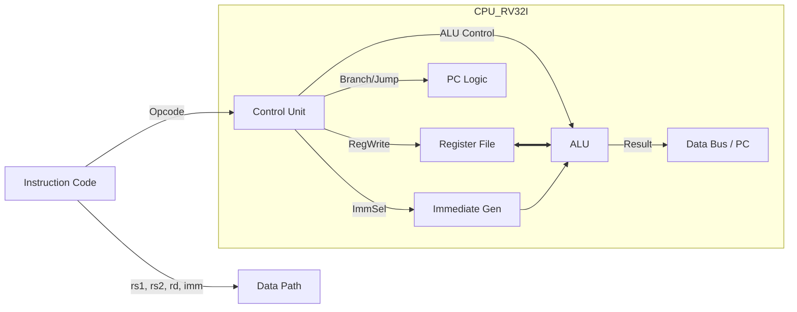

# 🚀 SystemVerilog RISC-V RV32I Processor

\<div align="center"\>

\
\
\
\

**32-bit RISC-V Instruction Set Architecture (ISA) Implementation**<br>
단일 사이클(Single-Cycle) 구조의 CPU 코어와 메모리 서브시스템을 통합한 MCU 설계

\</div\>

-----

## 📖 1. 프로젝트 개요 (Overview)

이 프로젝트는 **SystemVerilog**를 사용하여 **RISC-V RV32I (Base Integer Instruction Set)** 아키텍처를 구현한 프로세서 설계입니다.
CPU 코어(`CPU_RV32I`)는 **Control Unit**과 **DataPath**로 분리되어 체계적으로 설계되었으며, 최상위 모듈인 `MCU`에서 명령어 메모리(ROM)와 데이터 메모리(RAM)를 통합하여 실제 프로그램 실행이 가능한 임베디드 시스템 구조를 갖추고 있습니다.

### ✨ 핵심 기능 (Key Features)

  * [cite_start]**Full RV32I Support:** 산술/논리 연산, 메모리 접근(Load/Store), 분기(Branch), 점프(Jump) 등 기본 명령어 셋 지원[cite: 362].
  * **Single-Cycle Microarchitecture:** 모든 명령어가 1 클럭 사이클에 실행되는 구조.
  * **Modular Design:** 제어 유닛(Control Unit)과 데이터 처리 유닛(DataPath)의 명확한 분리.
  * [cite_start]**Memory Subsystem:** Byte, Half-word, Word 단위의 접근 및 Sign Extension을 지원하는 RAM/ROM 인터페이스[cite: 160].

-----

## 🏗️ 2. 시스템 아키텍처 (System Architecture)

### 2.1 Top-Level MCU Diagram

MCU는 CPU 코어를 중심으로 명령어 메모리(ROM)와 데이터 메모리(RAM)가 연결된 구조입니다.

```mermaid
graph TD
    subgraph "MCU (Micro Controller Unit)"
        ROM[Instruction Memory<br>(ROM)] -->|instrCode| CPU
        CPU[RISC-V CPU Core] -->|instrAddr| ROM
        
        CPU -->|busAddr / WData| RAM[Data Memory<br>(RAM)]
        CPU -->|we / strb| RAM
        RAM -->|busRData| CPU
    end
```

### 2.2 CPU Core Microarchitecture

CPU 내부는 **Control Unit**이 명령어를 해석하여 제어 신호를 생성하고, **DataPath**가 연산을 수행하는 구조입니다.



-----

## 💻 3. 상세 설계 명세 (Design Details)

### [cite_start]3.1 Control Unit [cite: 1]

명령어의 Opcode를 해독하여 Datapath의 MUX, ALU, Register File 등을 제어하는 신호를 생성합니다.

  * [cite_start]**Opcode Decoding:** R-Type, I-Type, S-Type, B-Type, J-Type, U-Type 등을 판별합니다[cite: 6].
  * [cite_start]**ALU Control:** `funct3`, `funct7` 필드를 결합하여 덧셈, 뺄셈, 논리 연산, 시프트 연산 등의 구체적인 ALU 동작 신호를 생성합니다[cite: 9].

### [cite_start]3.2 Data Path [cite: 290]

데이터의 흐름과 연산을 담당하는 핵심 모듈입니다.

  * [cite_start]**Register File:** 32개의 32-bit 레지스터(`x0`\~`x31`)를 포함하며, `x0`는 항상 0으로 고정됩니다[cite: 304].
  * [cite_start]**ALU (Arithmetic Logic Unit):** `ADD`, `SUB`, `SLL`, `SLT`, `XOR`, `OR`, `AND` 등의 연산과 분기 비교(`BEQ`, `BNE` 등)를 수행합니다[cite: 309].
  * [cite_start]**Immediate Extender:** 명령어 타입에 따라 12-bit 또는 20-bit 상수를 32-bit로 부호 확장(Sign Extension)합니다[cite: 332].
  * [cite_start]**PC Logic:** `JAL`, `JALR`, `Branch`에 의해 다음 프로그램 카운터(PC) 값을 계산합니다 [cite: 299-303].

### [cite_start]3.3 Memory Interface [cite: 160]

  * [cite_start]**ROM:** 초기화된 헥사 코드(`code.mem` 등)를 로드하여 명령어를 제공합니다[cite: 339].
  * **RAM:** `strb` (Strobe) 신호를 통해 Byte(8-bit), Half(16-bit), Word(32-bit) 단위의 쓰기/읽기를 지원합니다. [cite_start]`LB`, `LBU` 등의 명령어를 위해 부호 확장 로직이 포함되어 있습니다[cite: 166].

-----

## 📜 4. 지원 명령어 셋 (Supported ISA)

`defines.sv` 및 `ControlUnit.sv`에 정의된 지원 명령어 목록입니다.

| Type | Opcode | Instructions | Description |
| :---: | :---: | :--- | :--- |
| **R-Type** | `0110011` | ADD, SUB, SLL, SLT, SLTU, XOR, SRL, SRA, OR, AND | Register-Register 산술/논리 연산 |
| **I-Type** | `0010011` | ADDI, SLTI, SLTIU, XORI, ORI, ANDI, SLLI, SRLI, SRAI | Immediate 산술/논리 연산 |
| **I-Type** | `0000011` | LB, LH, LW, LBU, LHU | 메모리 로드 (Load) |
| **I-Type** | `1100111` | JALR | 레지스터 기반 점프 |
| **S-Type** | `0100011` | SB, SH, SW | 메모리 저장 (Store) |
| **B-Type** | `1100011` | BEQ, BNE, BLT, BGE, BLTU, BGEU | 조건부 분기 (Branch) |
| **U-Type** | `0110111` | LUI, AUIPC | 상위 비트 로드 |
| **J-Type** | `1101111` | JAL | 점프 및 링크 |

-----

## 📂 5. 디렉토리 구조 (Directory Structure)

```text
📦 RISCV-RV32I-SystemVerilog
 ┣ 📂 src
 ┃ ┣ 📂 core
 ┃ ┃ ┣ 📜 CPU_RV32I.sv       # [Top] CPU Top Module
 ┃ ┃ ┣ 📜 ControlUnit.sv     # Control Logic
 ┃ ┃ ┣ 📜 DataPath.sv        # Datapath Logic
 ┃ ┃ ┣ 📜 alu.sv             # ALU Module
 ┃ ┃ ┣ 📜 RegisterFile.sv    # 32x32 Register File
 ┃ ┃ ┣ 📜 immExtend.sv       # Immediate Generator
 ┃ ┃ ┗ 📜 defines.sv         # Opcode & Control Defines
 ┃ ┣ 📂 memory
 ┃ ┃ ┣ 📜 ROM.sv             # Instruction Memory
 ┃ ┃ ┗ 📜 RAM.sv             # Data Memory
 ┃ ┗ 📜 MCU.sv               # [System Top] MCU Wrapper
 ┣ 📂 sim
 ┃ ┗ 📜 tb_rv32i.sv          # Testbench for MCU
 ┗ 📜 README.md              # Project Documentation
```

-----

## 🚀 6. 실행 및 검증 (Simulation & Verification)

### 6.1 테스트벤치 실행 (`tb_rv32i.sv`)

[cite_start]제공된 테스트벤치는 `MCU`를 인스턴스화하고 클럭과 리셋을 공급하여 CPU의 동작을 검증합니다[cite: 48].

1.  **초기화:** `reset` 신호를 인가하여 PC 및 레지스터를 초기화합니다.
2.  [cite_start]**명령어 실행:** `ROM`에 내장된 어셈블리 코드(ADD, AND, SW, LW 등)가 순차적으로 실행됩니다[cite: 341].
3.  **결과 확인:** 시뮬레이션 파형(Waveform)을 통해 `busWData`(메모리 쓰기 값) 및 `RD1`, `RD2`(레지스터 값) 변화를 확인합니다.

### 6.2 실행 방법 (How to Run)

1.  **Vivado 실행:** Xilinx Vivado를 실행하고 새 프로젝트를 생성합니다.
2.  **소스 추가:** `src` 폴더 내의 모든 `.sv` 파일을 Design Sources로 추가합니다.
3.  **시뮬레이션 설정:** `tb_rv32i.sv`를 Simulation Source로 추가하고 Top Module로 설정합니다.
4.  **Run Simulation:** `Run Behavioral Simulation`을 클릭하여 동작을 검증합니다.

-----

\<div align="center"\>
\<i\>Designed with SystemVerilog for RISC-V Architecture Study\</i\>
\</div\>
